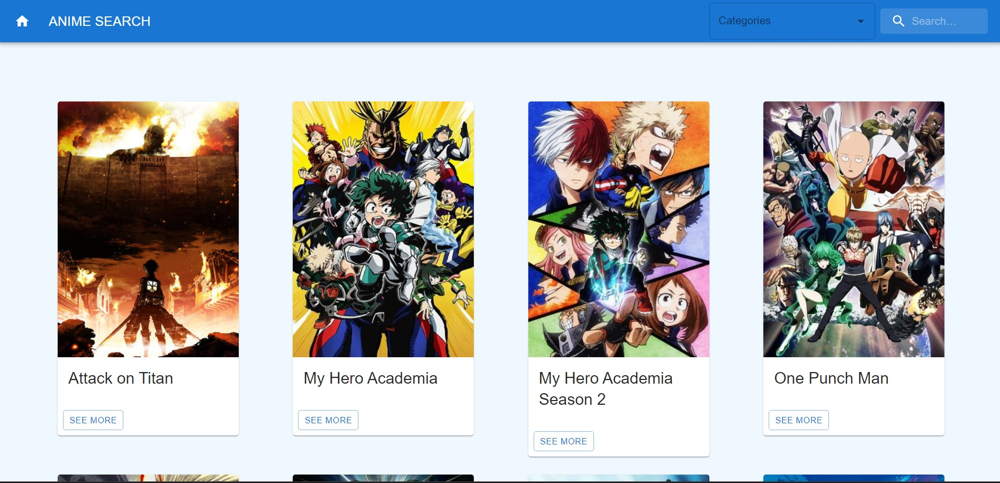

# Anime Search App 

  

> Explore anime information with ease! The Anime Search App provides random anime recommendations, anime categories, and search functionality. 🚀

  

## ✨ Features 

1. **Random Anime Recommendations:** Get recommendations for random anime.
2. **Anime Categories:** Explore anime categories and their titles.
3. **Search Functionality:** Search for specific anime based on filters like name, genre, or other criteria.

## 🏗️ Code Structure 

The application is structured with React components, utilizing React Router for navigation. Key components include:

- **App.js:** The main component defining the routes and navigation.
- **Home.js:** Displays random anime recommendations and a "Next" button to load new recommendations.
- **Categories.js:** Lists anime categories and allows users to explore anime within a specific category.
- **Search.js:** Provides a search interface allowing users to filter anime based on criteria like name or genre.

## 🌐 API Integration 

The application integrates with the Kitsu API (`https://kitsu.io/api/edge`) to fetch anime data. Axios is used for making asynchronous requests. Key functions in `api.js` include:

- `getRandomAnime`: Fetches a random anime recommendation.
- `getMultipleRandomAnime`: Fetches multiple random anime recommendations.
- `getCategories`: Fetches information about a specific anime category.
- `getAllCategories`: Fetches information about all anime categories.
- `filterSearch`: Filters anime based on search criteria.

## 🛠️ How to Run 

1. Clone the repository to your local machine.
2. Install dependencies using `npm install`.
3. Start the development server with `npm start`.
4. Open your web browser and go to [http://localhost:3000/](http://localhost:3000/).

## 📦 Dependencies 

- React
- React Router
- Axios
- MUI (Material-UI)
